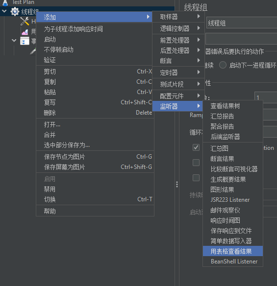

## Jmeter接口测试

文档版本 0.0.1

> written by typora

### 1.写一个服务器demo

> 技术栈： fastapi,peewee,mysql

* 创建一个简单的数据库

  ```sql
  /*
   Navicat Premium Data Transfer
  
   Source Server         : local
   Source Server Type    : MySQL
   Source Server Version : 80023
   Source Host           : localhost:3306
   Source Schema         : jmeter
  
   Target Server Type    : MySQL
   Target Server Version : 80023
   File Encoding         : 65001
  
   Date: 21/06/2022 15:56:00
  */
  
  SET NAMES utf8mb4;
  SET FOREIGN_KEY_CHECKS = 0;
  
  -- ----------------------------
  -- Table structure for hobby
  -- ----------------------------
  DROP TABLE IF EXISTS `hobby`;
  CREATE TABLE `hobby`  (
    `hobby_id` int NOT NULL AUTO_INCREMENT,
    `hobby_name` varchar(255) CHARACTER SET utf8mb4 COLLATE utf8mb4_0900_ai_ci NULL DEFAULT NULL,
    `user_id` int NULL DEFAULT NULL,
    PRIMARY KEY (`hobby_id`) USING BTREE
  ) ENGINE = InnoDB CHARACTER SET = utf8mb4 COLLATE = utf8mb4_0900_ai_ci ROW_FORMAT = Dynamic;
  
  -- ----------------------------
  -- Table structure for person
  -- ----------------------------
  DROP TABLE IF EXISTS `person`;
  CREATE TABLE `person`  (
    `user_name` varchar(255) CHARACTER SET utf8mb4 COLLATE utf8mb4_0900_ai_ci NULL DEFAULT NULL,
    `age` int NULL DEFAULT NULL,
    `user_id` int NOT NULL AUTO_INCREMENT,
    PRIMARY KEY (`user_id`) USING BTREE
  ) ENGINE = InnoDB CHARACTER SET = utf8mb4 COLLATE = utf8mb4_0900_ai_ci ROW_FORMAT = Dynamic;
  
  SET FOREIGN_KEY_CHECKS = 1;
  
  ```

  

  一共两个实体，person和hobby，一对多关系，然后用 peewee 工具同步一下数据库

  ```
  python -m pwiz -e mysql -u root -H localhost -p 3306  --password  Jmeter > model.py
  ```

  得到model.py文件，里面会用python定义好实体类。

  ```python
  from peewee import *
  
  database = MySQLDatabase('Jmeter', **{'charset': 'utf8', 'sql_mode': 'PIPES_AS_CONCAT', 'use_unicode': True, 'host': 'localhost', 'port': 3306, 'user': 'root', 'password': '******'})
  
  class UnknownField(object):
      def __init__(self, *_, **__): pass
  
  class BaseModel(Model):
      class Meta:
          database = database
  
  class Hobby(BaseModel):
      hobby_id = AutoField()
      hobby_name = CharField(null=True)
      user_id = IntegerField(null=True)
  
      class Meta:
          table_name = 'hobby'
  
  class Person(BaseModel):
      age = IntegerField(null=True)
      user_id = AutoField()
      user_name = CharField(null=True)
  
      class Meta:
          table_name = 'person'
  ```

* 编写后台代码

  ```python
  from typing import List
  from fastapi import FastAPI
  from pydantic import BaseModel
  from model import Hobby, Person
  
  app = FastAPI()
  
  
  class NewUserReq(BaseModel):
      name: str
      age: int = 10
      hobbies: List[str]
  
  
  class NewUserResponse(BaseModel):
      user_id: int
  
  
  class ChangeAgeReq(BaseModel):
      user_id: int
      age: int
  
  
  class UserInfo(BaseModel):
      user_id: int
      user_name: str
      age: int
      hobbies: List[str]
  
  
  @app.get("/")
  async def test():
      return {"message": "hello IO"}
  
  
  @app.post("/newuser")
  async def new_user(u: NewUserReq):
      person = Person()
      person.age = u.age
      person.user_name = u.name
      result = person.save()
      if result == 1:
          print(person.user_id)
          for i in u.hobbies:
              h = Hobby()
              h.user_id = person.user_id
              h.hobby_name = i
              h.save()
          us = NewUserResponse(user_id=person.user_id)
          return {"message": "hello IO", "data": us}
      else:
          return {"message": "error"}
  
  
  @app.post("/changeage")
  async def change_age(c: ChangeAgeReq):
      try:
          p: Person = Person.get(user_id=c.user_id)
          print(p.user_name)
          p.age = c.age
          p.save()
          return {"message": "IO"}
      except:
          return {"message": "error"}
  
  
  @app.get("/user/{pid}")
  async def get_user_by_id(pid):
      try:
          p: Person = Person.get(user_id=pid)
          hres = Hobby.select(Hobby.hobby_name).where(Hobby.user_id == pid)
          hbs = []
          for i in hres:
              hbs.append(i.hobby_name)
          u = UserInfo(user_id=p.user_id,user_name=p.user_name,age=p.age,hobbies=hbs)
          return {"message": "IO","data":u}
      except Exception as e:
          print(e)
          return {"message": "error"}
  ```

  然后uvicorn部署一下

  ```
  uvicorn.exe  app:app --reload --port 65423 --host 0.0.0.0
  ```

### 2. Jmeter测试

#### 2.1 Jmeter简介

```
	Apache JMeter 是 Apache 组织基于 Java 开发的压力测试工具，用于对软件做压力测试。
	JMeter 最初被设计用于 Web 应用测试，但后来扩展到了其他测试领域，可用于测试静态和动态资源，如静态文件、Java 小服务程序、CGI 脚本、Java 对象、数据库和 FTP 服务器等等。JMeter 可对服务器、网络或对象模拟巨大的负载，在不同压力类别下测试它们的强度和分析整体性能。另外，JMeter 能够对应用程序做功能/回归测试，通过创建带有断言的脚本来验证程序是否返回了期望结果。为了最大限度的灵活性，JMeter 允许使用正则表达式创建断言。
JMeter的作用
	1.能够对HTTP和FTP服务器进行压力和性能测试， 也可以对任何数据库进行同样的测试（通过JDBC）。
	2.完全的可移植性和100% 纯java。
	3.完全 Swing 和轻量组件支持（预编译的JAR使用 javax.swing.*)包。
	4.完全多线程 框架允许通过多个线程并发取样和 通过单独的线程组对不同的功能同时取样。
	5.精心的GUI设计允许快速操作和更精确的计时。
	6.缓存和离线分析/回放测试结果。
JMeter的高可扩展性
	1.可链接的取样器允许无限制的测试能力。
	2.各种负载统计表和可链接的计时器可供选择。
	3.数据分析和可视化插件提供了很好的可扩展性以及个性化。
	4.具有提供动态输入到测试的功能（包括Javascript）。
	5.支持脚本编程的取样器（在1.9.2及以上版本支持BeanShell）。
	在设计阶段，JMeter能够充当HTTP PROXY（代理）来记录IE/NETSCAPE的HTTP请求，也可以记录apache等WebServer的log文件来重现HTTP流量。当这些HTTP客户端请求被记录以后，测试运行时可以方便的设置重复次数和并发度（线程数）来产生巨大的流量。JMeter还提供可视化组件以及报表工具把量服务器在不同压力下的性能展现出来。
相比其他HTTP测试工具,JMeter最主要的特点在于扩展性强。JMeter能够自动扫描其lib/ext子目录下.jar文件中的插件，并且将其装载到内存，让用户通过不同的菜单调用。 (摘自百度2022.6.21)
```

#### 2.2 Jmeter安装

* 下载

  地址：http://jmeter.apache.org/

* 配置环境变量

   jmeter是在jdk环境下运行，首先安装jdk(版本1.8以上，安装的时候把jdk和jre都装上)，配置Java环境变量

#### 2.3 运行

​		Jmeter支持全桌面平台，下载Jmeter完成之后，解压，运行对应的文件。windows是`*/bin/jmeter.bat`,其它平台是`*/bin/jmeter.sh`，windows 下直接双击就可以打开界面，其它平台可能需要指令启动。


<center>Jmeter主界面</center>


<center>options->choose language可以修改中文界面，但是中文翻译有点怪怪的</center>


<center>创建一个新的用例（快捷键ctrl+s可以保存成文件）</center>


<center>右键这个 Test Plan, 然后添加线程组。一个线程组可以看成是一个测试用例，不过这个测试用例天生支持多线程压力测试 </center>


<center>默认是一个线程，我们就用一个线程演示</center>


<center>新建一个事务控制器，这个控制器可以实现逻辑接口</center>


<center>在这个事务控制器里添加取样器，一般都是HTTP请求。一个http请求就是一次接口测试</center>


<center>这个界面有点像postman,协议那里默认是http,可以改成https</center>

**我们来做一个简单测试**


<center>这是一个新建用户的接口，填写完成之后，我们点击顶部运行键</center>


***然后报错了***


服务器报了“unprocessable entity”的错误，而且jmeter没有反应。这是两个问题，我们一个个解释。

**第一个问题**

因为我们上传的是参数是json格式的，但是没有定义`Content-Type`,所以服务器无法解析这个参数。处理方法也很简单


在线程组里添加一个消息头管理器，然后填入以下内容


再次运行，服务器就正常了。


**第二个问题**

jmeter没有反馈，是因为我们没有定义

jmeter其实有很多种结果反馈，这里提供一种常见的`用表格查看结果`，同样地，我们需要手动添加到测试计划中。



<center>其他的结果可以自行尝试</center>

我们可以用文件保存结果。


<center>一般用csv格式的文件存储</center>


<center>这里如果没有那个文件，会有异常，但是工具本身会新建一个文件，所以我不清楚是不是逻辑上有问题</center>

再次运行。


<center>可以看到运行结果了</center>

***如果需要看请求的响应数据，需要添加另一个结果***


#### 2.4 添加断言判断

jmeter支持多种断言形式，我们这里用json断言做个演示，这里有个详细的[案例介绍](https://blog.csdn.net/weixin_45580903/article/details/124405798)


这里我们故意写错，将期望返回结果的写成“hello IO1”,然后再执行一下，看看结果。


<center>两边的结果集中都报错了，结果树中的错误比较完整，告诉我们期望结果是满足这个条件的正则匹配，但是得到的结果是“hello IO”</center>

#### 2.5 流程化测试

进入正题。


<center>切换回事务控制器，把这个勾上，使得事务控制器下的请求成为一个整体</center>

**我这里设计了一个流程，创建新用户---返回用户id---根据用户id修改用户年龄--返回结果必须是{“message”:"IO"}，一共涉及两个接口**

***所以这里就需要获取第一个接口中返回的用户id***

我们先把两个测试用例写好。


<center>这里缺少一个参数“user_id”，怎么填入呢？</center>

我们在`创建新用户`那个栏目，添加一个提取器。


<center>这里选择的是后置正则表达式处理器</center>

**写正则表达式有点麻烦，还好jmeter做了正则匹配Tester**


然后我们填入正则表达式提取器。


再测试一下。


通过了。

**我们看下数据库有没有这个人**


***人是有了，但是为什么中文字都是问号？？？***

大概率是编码问题没跑了。

我们返回http提取器这里，修改内容编码，改成utf8


再测试一下。


OK，王五也来了，一家人整整齐齐。

>  **[这里](https://blog.csdn.net/notHavaBug/article/details/112576952)有一个获取token之后登录的逻辑，讲解的很详细。**

### 3 总结

jmeter这个工具本身功能比较强大，提供了大量测试相关的数据图表，不过这些我一个都没用过。本次只是简单介绍一下jmeter事务测试，更多的内容还要花时间研究。
