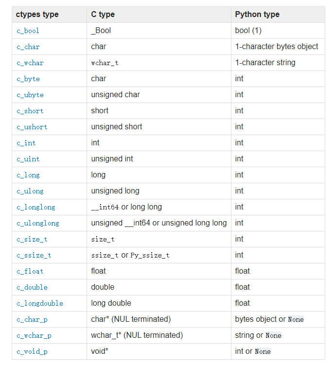

**引言** python哪里都好，就是某些时候比较慢。但也并不代表所有的python代码写出来就会比别的慢，如果底层实现是c/c++的（如```opencv-python```,```numpy```等），运行速度也可以飞快。那么，实现一些diy的基础功能，怎么才能够让这些“快速”的语言为python服务呢？下面以golang为例说明（虽然golang也没有很快，不过做例子要比c++精简很多）。

--------

首先我们要知道一点，golang（或者c/c++等）是可以编译成可执行文件以及动态链接库（dll,so）的，而python是可以直接调用dll(windows)以及so(linux)方法的，一切都顺利成章，体系贯通，极具编程的美学。

由于我们最终是要用python去调用dll/so库，所以首先要了解python以及c之间数据类型的[对应关系](https://docs.python.org/3/library/ctypes.html)。



第一列是ctypes中的类型（python中的一个模块），第二列是c语言中的数据类型，第三列是python的数据类型。**But**,这还是python调用c/c++直接编译成的dll时需要注意的类型匹配，如果是golang呢？

这里就需要介绍一下[cgo](https://studygolang.com/articles/16315),简单来说，CGO 提供了 golang 和 C 语言相互调用的机制。某些第三方库可能只有 C/C++ 的实现，完全用纯 golang 的实现可能工程浩大，这时候 CGO 就派上用场了。可以通 CGO 在 golang 在调用 C 的接口，C++ 的接口可以用 C 包装一下提供给 golang 调用。被调用的 C 代码可以直接以源代码形式提供或者打包静态库或动态库在编译时链接。不过我们的目的是用python调用golang的代码。同样的，cgo和go之间也存在数据类型[匹配问题](https://www.cnblogs.com/adjk/p/9469845.html)。

```
c         cgo         go

char -->  C.char -->  byte
signed char -->  C.schar -->  int8
unsigned char -->  C.uchar -->  uint8
short int -->  C.short -->  int16
short unsigned int -->  C.ushort -->  uint16
int -->  C.int -->  int
unsigned int -->  C.uint -->  uint32
long int -->  C.long -->  int32 or int64
long unsigned int -->  C.ulong -->  uint32 or uint64
long long int -->  C.longlong -->  int64
long long unsigned int -->  C.ulonglong -->  uint64
float -->  C.float -->  float32
double -->  C.double -->  float64
wchar_t -->  C.wchar_t  --> 
void * -> unsafe.Pointer
```

下面通过两个例子简单说明一下怎么通过python调用go编译好的dll。

> 但是，要在windows上将go编译成dll文件，需要用到gcc工具。我们知道啊，windows是个对开发者不友好的平台，不管是什么和c沾边的，大部分都需要 virtual studio加持，或者gcc/g++等。所以能够在windows上完美写代码的，环境配置问题基本不存在，也从来不必劝别人用别的操作系统来应对环境问题。
>
> 安装[gcc工具](https://blog.csdn.net/qq_18145605/article/details/117438894)可能会遇到安装过程中下载失败的问题，可以直接下载这个[压缩包](https://jaist.dl.sourceforge.net/project/mingw-w64/Toolchains%20targetting%20Win64/Personal%20Builds/mingw-builds/8.1.0/threads-posix/seh/x86_64-8.1.0-release-posix-seh-rt_v6-rev0.7z)解压,然后添加一下环境变量，重启一下vscode。
>
> 另外，不知道为什么 vscode 在使用 cgo 过程中代码有错误提示，会报```*** not declared by package C```的错误。我用的vscode版本是1.66.2， golang插件版本是 v0.32.0。


## 例子1 简单的加法以及打印字符串

```go
package main

import "C" //必须引入C库

import "fmt"

//加入下面注释代码，表示导出，可以被python调用

//export PrintDll
func PrintDll() {
	fmt.Println("我来自dll")
}

//
//export Sum
func Sum(a int, b int) int {
	return a + b
}

func main() {
	//必须加一个main函数，作为CGO编译的入口，无具体实现代码
}
```


> 注意，//export 的注释符号和export之间不能有空格，别问我为什么知道。

然后编译成dll。

```
go build -buildmode=c-shared -o t1.dll .\t1.go
```

编译成so文件也是一个指令，只要将dll换成so即可。 ```-o```参数之后第一个是目标文件，第二个是源码文件。编译完成之后，在当前目录就能出现两个文件```t1.dll``` 以及 ```t1.h``` 了，前者就是我们想要的，后者本文中无关紧要。

**然后**我们开始写python代码。

```python
import ctypes

lib = ctypes.CDLL('./sum.so')
print(lib.Sum(7, 11))

lib.PrintDll()
```

执行之后就可以得到```18```以及```我来自dll```了。但是这个例子中入参和返回值都是int类型，而且第二个例子也只是调用了golang的打印功能，如果要使用更加复杂的string类型呢？

## 例子2 复杂的字符串输入输出

这里的用例是一个用sm4加密的功能。

怎么字符串就算是复杂输入输出了呢？我们知道，c语言是没有string类型的，只有char数组类型。所以golang不能用自己的```string```类型作为入参，需要借助cgo。上文已经讲过对应关系，也就是 ```C.char```这个类型。

下面来看一下golang的代码,用到了一个sm4加解密的包（这里不得不提一下为什么我不直接用python做sm4加解密，因为python的第三方包加解密出来和go结果不一样，看github issue貌似是实现的有问题，所以不得不用这种非常优秀的做法完成加解密过程）。

```go
package main

import "C" //必须引入C库
import (
	"fmt"

	"github.com/tjfoc/gmsm/sm4"
)

//export EncryptSM4
func EncryptSM4(plainText []byte) (string, error) {
	key := "qwertyuiasdfghjk"
	val, err := sm4.Sm4Cbc([]byte(key), plainText, true)

	return fmt.Sprintf("%x", val), err
}

//export Encode
func Encode(s *C.char) *C.char {
	val, err := EncryptSM4([]byte(C.GoString(s)))
	if err != nil {
		fmt.Printf("err: %v\n", err)
		return C.CString("")
	}
	fmt.Printf("val: %v\n", val)
	return C.CString(val)
}

func main() {

}
```

这里我们看到，主要调用的函数 ```Encode``` 入参和返回值都是 ```*C.char```类型，也就是一个引用。然后通过```C.GoString()```方法将其转化为golang的string类型，进行加密操作。返回值也是同理，通过```C.CString()```方法再将golang的字符串转化为```*C.char```。

**编译一下**,取名叫 sm4.dll。

然后来写python的代码。

```python
from ctypes import c_char_p, cdll
import ctypes

lib = cdll.LoadLibrary('./sm4.dll')
lib.Encode.restype = ctypes.c_uint64

res = lib.Encode(c_char_p(bytes("golang is never better than python","utf-8")))
print(ctypes.string_at(res))
```

我们可以看到，这里和上一次的代码多了一些东西，一个是 ```c_char_p()```方法，我们使用它来把python bytes数组转化为需要的 ```*C.char``` 类型；其次是 打印的时候使用了 ```ctypes.string_at()```方法，我们知道返回的还是一个引用，所以需要从这个地址中把数据解析出来,没有的话打印出来的就是地址；最后，```lib.Encode.restype = ctypes.c_uint64```才是重中之重，必须要另起一段说明。

先说一下，如果没有这一行的话，会引起 ```OSError: exception: access violation reading ...```这个exception，而且据说只在windows的64bit python中[出现](https://www.polarxiong.com/archives/Python-x64%E4%B8%8Bctypes%E5%8A%A8%E6%80%81%E9%93%BE%E6%8E%A5%E5%BA%93%E5%87%BA%E7%8E%B0access-violation%E7%9A%84%E5%8E%9F%E5%9B%A0%E5%88%86%E6%9E%90.html)（32bit 的运行良好），这就真是极好的，因为又能够学到新的解决方案了。简单来说，原因是这样的：

`ctypes.string_at()`在官方文档里给出的描述是

> ctypes.string_at(address, size=-1)
>
> This function returns the C string starting at memory address address as a bytes object. If size is specified, it is used as size, otherwise the string is assumed to be zero-terminated.

`string_at()`接受的参数是内存地址，似乎隐约知道出错的原因了：给`string_at()`传递了一个错误的内存地址，导致程序执行时试图访问非法的内存地址，提示错误。

但传入`string_at()`的参数是由API直接返回的，怎么会出错呢？继续看官方文档，官方文档中提到在加载动态链接库时

> Functions in these libraries use the standard C calling convention, and are assumed to return int.

意思就是C-API中任何类型的返回值，在Python中统一都是int，这样也容易理解：返回int类型就是int值，返回指针就是内存地址（毕竟指针实际就是记录内存地址的）。解决方案也很简单，`restype`可以重载API的返回值类型（记得上面说的默认值为int吧），因为64位下内存地址为64位无符号型整数，因此设置为`ctypes.c_uint64`。

如此，就可以准确得到sm4加密后的结果了。

## 总结

[**点击查看完整代码**](../pkgs/go2py_sm/readme.md)

