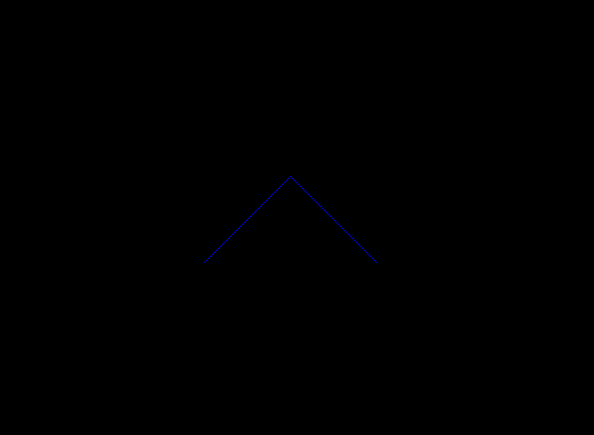
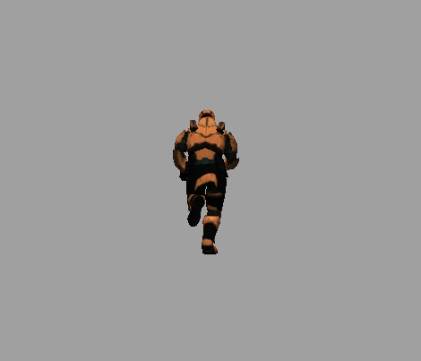
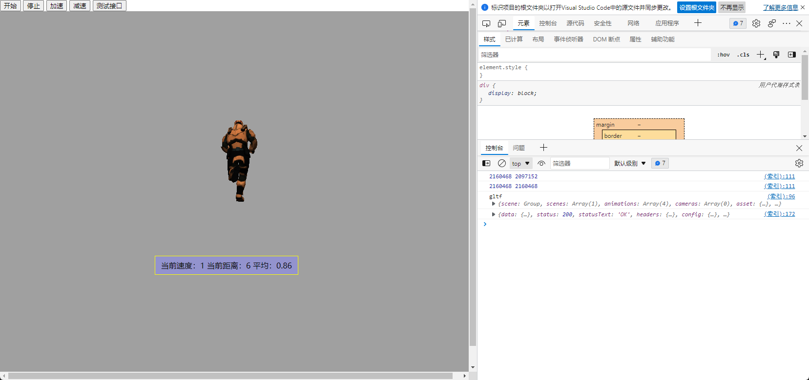

# three.js 学习笔记-01

# 0 相关资源

[three.js官方文档](https://threejs.org/docs/index.html#manual/zh/introduction/Creating-a-scene)

[3D模型下载地址](https://github.com/mrdoob/three.js/blob/dev/examples/models/gltf/Soldier.glb)

# 1 安装

## 1.1 相对路径导入(推荐)

```html
<body>
	<script src="js/three.js"></script>
	<script>
		// Our Javascript will go here.
	</script>
</body>
```

## 1.2 cdn js加载方案（推荐）

```html
 <script type="importmap">
        {
            "imports": {
                "three": "https://unpkg.com/three@0.142.0/build/three.module.js"
            }
        }
 </script>
<script type="module">
	import * as THREE from 'three';
    import { GLTFLoader } from 'https://unpkg.com/three@0.142.0/examples/jsm/loaders/GLTFLoader.js';
</script>
```

## 1.3 node安装（官方和我都不推荐）

```HTML
npm install three //然后你会发现很难用，尤其是导入单个three.js模块的时候
```

three.js 官方不推荐使用node安装这个库，理由如下：

> Because three.js is built for the web, it depends on browser and DOM APIs that don't always exist in Node.js. Some of these issues can be resolved by using shims like [headless-gl](https://github.com/stackgl/headless-gl), or by replacing components like TextureLoader with custom alternatives. Other DOM APIs may be deeply intertwined with the code that uses them, and will be harder to work around. We welcome simple and maintainable pull requests to improve Node.js support, but recommend opening an issue to discuss your improvements first.
>
> Make sure to add `{ "type": "module" }` to your `package.json` to enable ES6 modules in your node project.

## 1.4 第三方支持的库react-three(不是很推荐)

[react-three-fiber](https://github.com/pmndrs/react-three-fiber)

不推荐的理由主要是我没能实现他们官方提供的代码效果，而且这个和原始的three.js api差异比较大，有一定的学习成本（three.js的学习成本就已经很高了）

### 综上所述，我个人推荐使用cdn这种依赖方式

# 2 开始写代码

## 2.1 使用node新建一个空白的项目

> mkdir xxx
>
> npm init .
>
> 然后手动创建一个名为 `index.html` 的文件
>
> npm install http-server -g

然后修改`package.json`

```json
 "scripts": {
    "test": "echo \"Error: no test specified\" && exit 1",
    "start": "http-server . -p 8000"
  }
```

接着就可以用 `mpn start`开启这个页面

## 2.2 用 three.js 绘制直线

我们在`index.html` 中添加以下代码

```html
<script type="importmap">
        {
            "imports": {
                "three": "https://unpkg.com/three@0.142.0/build/three.module.js"
            }
        }
</script>
<script type="module">
        import * as THREE from 'three';
        const renderer = new THREE.WebGLRenderer();
        renderer.setSize(window.innerWidth, window.innerHeight);
        document.body.appendChild(renderer.domElement);

        const camera = new THREE.PerspectiveCamera(45, window.innerWidth / window.innerHeight, 1, 500);
        camera.position.set(0, 0, 100);
        camera.lookAt(0, 0, 0);

        const scene = new THREE.Scene();

        //create a blue LineBasicMaterial
        const material = new THREE.LineBasicMaterial({ color: 0x0000ff });

        const points = [];
        points.push(new THREE.Vector3(- 10, 0, 0));
        points.push(new THREE.Vector3(0, 10, 0));
        points.push(new THREE.Vector3(10, 0, 0));

        const geometry = new THREE.BufferGeometry().setFromPoints(points);

        const line = new THREE.Line(geometry, material);

        scene.add(line);
        renderer.render(scene, camera);
</script>
```

运行之后得到如下结果：



**整个流程可以梳理为**：

1. 创建一个渲染器`renderer`,设置渲染器的长宽尺寸（本例中为浏览器窗口大小）
2. 使用`document.body.appendChild(renderer.domElement)`将渲染器的dom元素加到body末尾
3. 创建一个相机`camera`，本例中使用的是`PerspectiveCamera`,然后把camera的位置放在(0, 0, 100)座标出，lookAt方法指的是相机观察的目标点，相机lookAt的点一定显示在屏幕的正中央：利用这点，我们可以实现物体移动时，我们可以一直跟踪物体，让物体永远在屏幕的中央（关于three.js 中关于投影矩阵等内容可以看这个[文章](https://baijiahao.baidu.com/s?id=1680217160344998723&wfr=spider&for=pc)，大致可以理解为整个页面是一个3D的长方体，中心处坐标为（0，0，0））。所以，我们可以通过移动camera，移动物体等方法实现物体移动。
4. 创建`scene`
5. 创建物体，这个例子中是线段，我们用的更多的应该是别人做好的3d模型
6. 在`scene`中添加这个物体，然后使用渲染器渲染

## 2.3 three.js 引入3D模型

three.js 中支持的3d模型种类很多，一般使用`FBXLoader`(对应格式fbx)以及`GLTFLoader`(对应格式gltf或者glb,gltf文件是json格式的，glb是二进制文件)

```html
<script type="importmap">
        {
            "imports": {
                "three": "https://unpkg.com/three@0.142.0/build/three.module.js"
            }
        }
</script>
<script type="module">
    import * as THREE from 'three';
    import { GLTFLoader } from 'https://unpkg.com/three@0.142.0/examples/jsm/loaders/GLTFLoader.js';
    import { OrbitControls } from "https://unpkg.com/three@0.142.0/examples/jsm/controls/OrbitControls.js"; //这是控制器，用来控制camera的
    
    let mixer;
    
    const gltfLoader = new GLTFLoader();
    const scene = new THREE.Scene();
    const camera = new THREE.PerspectiveCamera(75, window.innerWidth / window.innerHeight, 0.1, 1000);
    camera.position.z = 5;
    
    const renderer = new THREE.WebGLRenderer();
    renderer.setSize(window.innerWidth, window.innerHeight);
    document.body.appendChild(renderer.domElement);
    
    const controls = new OrbitControls(camera, renderer.domElement);//创建控制器
    
    scene.background = new THREE.Color(0xa0a0a0);  // 设置背景
    scene.fog = new THREE.Fog(0xa0a0a0, 10, 30);  // 设置雾化
    
    const hemiLight = new THREE.HemisphereLight(0xffffff, 0x444444);
    hemiLight.position.set(0, 10, 0);
    scene.add(hemiLight);    // 以上代码是设置半球形光源，如果没有光源那么页面就是黑色的，和上一个例子中一样
    
    const directionalLight = new THREE.DirectionalLight(0xFFFFFF);
    directionalLight.castShadow = true;
    directionalLight.shadow.camera.near = 0.5;
    directionalLight.shadow.camera.far = 50;
    directionalLight.shadow.camera.left = -10;
    directionalLight.shadow.camera.right = 10;
    directionalLight.shadow.camera.top = 10;
    directionalLight.shadow.camera.bottom = -10;
    directionalLight.position.set(0, 5, 5);
    scene.add(directionalLight);  // 设置平行光源
    
    gltfLoader
        .load('Soldier.glb', function (gltf) {
        console.log("gltf", gltf)
        gltf.scene.scale.set(1, 1, 1)
        gltf.scene.traverse(function (child) {
            if (child instanceof THREE.Mesh) {
                child.castShadow = true; //阴影
                child.receiveShadow = true; //接受别人投的阴影
            }
        });
        mixer = startAnimation(
            gltf.scene,
            gltf.animations,
            gltf.animations[1].name // animationName，这里是"Run"
        );
        scene.add(gltf.scene);
    }, function (res) {
        console.log(res.total, res.loaded)
    });  // 读取模型文件
    
    renderer.setClearColor(new THREE.Color(0xbbbbbb));
    
    // 设置动画，这个例子中必须要设置动画，否则物体会不渲染
    function startAnimation(skinnedMesh, animations, animationName) {
        const m_mixer = new THREE.AnimationMixer(skinnedMesh);
        const clip = THREE.AnimationClip.findByName(animations, animationName);

        if (clip) {
            const action = m_mixer.clipAction(clip);
            action.play();
        }

        return m_mixer;
    };
    
    function animate() {
            requestAnimationFrame(animate);
            if (mixer) {
                mixer.update();
            }

            renderer.render(scene, camera);
    };
    
    animate();
    
</script>
```

现在刷新页面，应该会展示这样的画面：



同时，可以使用鼠标左键拖拽旋转这个人物。

## 2.4 播放动画

2.3中的模型本身是一个动画，是可以运动的。由于我们只是拿了整个模型的第一个动作渲染，所以没有动起来。这里只要设置一个时钟，刷新这个模型就可以了。

在2.3的代码中修改如下内容：

```html
<script>
let clock = new THREE.Clock();

function animate() {
            requestAnimationFrame(animate);
            if (mixer) {
                mixer.update(clock.getDelta());
            }

            renderer.render(scene, camera);
};
</script>

```

然后界面中的人物就会匀速动起来了。

## 2.5 动画播放速度

这里可以理解为你的刷新率越高，运动地越快，看上去也就越快，这里，我们只要将`mixer.update(clock.getDelta());`中添加一个参数 `factor`,`mixer.update(clock.getDelta()*factor)`,当这个`factor=0`的时候，动画就停止了，大于1的时候为加速，小于1的时候为减速。

# 3 服务器交互

## 3.1 服务器端代码（python,fastapi）

```python
from threading import Thread
from fastapi import FastAPI
from fastapi.middleware.cors import CORSMiddleware
import uvicorn
import time

app = FastAPI(version="0.0.1")


class Running:
    def __get_path__(self):
        while True:
            if self.isRunning:
                self.path += self.speed
                self.time += 1
                # print(self.path)
            time.sleep(1)

    def __init__(self) -> None:
        self.isRunning = False
        self.speed = 0
        self.path = 0
        self.time = 1
        self.thread = Thread(target=self.__get_path__)
        self.thread.start()

    def start(self):
        if not self.isRunning:
            self.speed = 1
            self.isRunning = True

    def speed_up(self):
        if self.isRunning:
            self.speed = 2

    def slow_down(self):
        if self.isRunning:
            self.speed = 0.5

    def stop(self):
        if self.isRunning:
            self.speed = 0
            self.isRunning = False


runningStatus: Running = Running()

app.add_middleware(
    CORSMiddleware,
    # 允许跨域的源列表，例如 ["http://www.example.org"] 等等，["*"] 表示允许任何源
    allow_origins=["*"],
    # 跨域请求是否支持 cookie，默认是 False，如果为 True，allow_origins 必须为具体的源，不可以是 ["*"]
    allow_credentials=False,
    # 允许跨域请求的 HTTP 方法列表，默认是 ["GET"]
    allow_methods=["*"],
    # 允许跨域请求的 HTTP 请求头列表，默认是 []，可以使用 ["*"] 表示允许所有的请求头
    # 当然 Accept、Accept-Language、Content-Language 以及 Content-Type 总之被允许的
    allow_headers=["*"],
    # 可以被浏览器访问的响应头, 默认是 []，一般很少指定
    # expose_headers=["*"]
    # 设定浏览器缓存 CORS 响应的最长时间，单位是秒。默认为 600，一般也很少指定
    # max_age=1000
)


@app.on_event('startup')
def init_state():
    global runningStatus
    return runningStatus


@app.get("/")
async def root():
    return {"message": "Hello World"}


@app.get("/start")
async def start_work():
    global runningStatus
    runningStatus.start()
    return {"speed": runningStatus.speed}


@app.get("/stop")
async def stop_work():
    global runningStatus
    runningStatus.stop()
    return {"speed": runningStatus.speed}


@app.get("/speedup")
async def speed_up():
    global runningStatus
    runningStatus.speed_up()
    return {"speed": runningStatus.speed}


@app.get("/slowdown")
async def slow_down():
    global runningStatus
    runningStatus.slow_down()
    return {"speed": runningStatus.speed}


@app.get("/status")
async def slow_down():
    global runningStatus
    return {
        "speed": runningStatus.speed,
        "time": runningStatus.time,
        "path": runningStatus.path,
        "ava":  round(runningStatus.path/runningStatus.time,2) 
    }


if __name__ == "__main__":
    uvicorn.run("app:app", port=14378, host="0.0.0.0", reload=True)
```

## 3.2 前端html改造

引入 `axios`

```html
<script src="https://unpkg.com/axios/dist/axios.min.js"></script>
```

编写接口

```html
    <script>
        function testApi() {
            axios({
                method: "get",
                url: "http://192.168.50.75:14378/"
            }).then((resp) => {
                console.log(resp);
                document.getElementById("overlay").innerHTML = resp.data.message
            })
        }
        function start() {
            axios({
                method: "get",
                url: "http://192.168.50.75:14378/start"
            }).then((resp) => {
                console.log(resp);
                factor = resp.data.speed
            })
        }
        function stop() {
            axios({
                method: "get",
                url: "http://192.168.50.75:14378/stop"
            }).then((resp) => {
                console.log(resp);
                factor = resp.data.speed
            })
        }
        function speedUp() {
            axios({
                method: "get",
                url: "http://192.168.50.75:14378/speedup"
            }).then((resp) => {
                console.log(resp);
                factor = resp.data.speed
            })
        }
        function slowdown() {
            axios({
                method: "get",
                url: "http://192.168.50.75:14378/slowdown"
            }).then((resp) => {
                console.log(resp);
                factor = resp.data.speed
            })
        }

        function setTimer() {
            let timer = null
            axios({
                method: "get",
                url: "http://192.168.50.75:14378/status"
            }).then(resp => {
                // console.log(res)
                document.getElementById("overlay").innerHTML = "当前速度：" + resp.data.speed 
                + "\n" + "当前距离：" + resp.data.path 
                + "\n" + "平均：" + resp.data.ava
            })

        }

        self.setInterval("setTimer()", 1000)

    </script>
    <script>
        // 这个是刷新的时候发一个停止运行的请求到后端，不然后端还一直在跑
        window.onbeforeunload = function(){
            stop()
        }
    </script>
```

修改html样式和按钮事件

```html
<head>
    <meta charset="utf-8">
    <title>My first three.js app</title>
    <style>
        body {
            margin: 0;
        }

        .four {
            position: absolute;
            background: rgb(147, 147, 206);
            outline: 1px solid #ff0;
            bottom: 200px;
            right: 350px;
            z-index: 50;
            padding: 8px 12px;
        }
    </style>
</head>
<body>
    <div id="target-area">
        <input type="button" value="开始" onclick="start()" />
        <input type="button" value="停止" onclick="stop()" />
        <input type="button" value="加速" onclick="speedUp()" />
        <input type="button" value="减速" onclick="slowdown()" />
        <input type="button" value="测试接口" onclick="testApi()" />
    </div>
    <div id="overlay" class="four">z-index = 50</div>
</body>
```


然后整个页面就是这样的：



可以通过上面一排按钮修改状态