## flutter web端打包优化方案

文档版本:0.0.1

### 参考

* [大前端时代的乱流：带你了解最全面的 Flutter Web](https://zhuanlan.zhihu.com/p/511181734)

* [github 案例](https://github.com/CarGuo/gsy_flutter_demo)
  
* [美团FlutterWeb性能优化探索与实践](https://juejin.cn/post/7043700931480780831)

### 简介

​		flutter在2.0版本开始支持稳定的web端应用开发，现在（2022年6月16日）3.0.2版本，已经有很多web应用使用flutter开发，比如美团外卖课堂这个[h5小程序](https://collegewm.meituan.com/#/college/home)(不知道他们会不会改技术栈，但是这个h5打包优化要比本文所讲的还要优秀)，[github](https://github.com/flutter/flutter/issues/46589#issuecomment-911630257)上一堆老外都在猜美团怎么做的。

​		flutter web打包总共有两种方式**html渲染**和**canvaskit**渲染，谷歌是推荐后者的，因为后者渲染完成之后性能好，更流畅。flutter的游戏引擎[flame](https://github.com/flame-engine/flame)在web端也是只有后者渲染方式（据说）。

> **「默认情况下 Flutter Web 在打包渲染时会把 html 和 canvaskit 都打包进去，然后在 PC 端使用 canvaskit 模式，在 mobile 端使用 html 模式」**
>
> 另外，如果不用flutter做web，可以直接用dart操作html，然后打包成web应用（有点像jquery）

### 实验需要

* flutter版本2.0以上，我是3.0.1（3.0.2有一个iOS打包问题，所以我又退回来了，尽管我没有mac）
* nginx

### canvaskit 打包优化方案

​	先抛砖引玉，讲一讲canvaskit打包优化方案。

​	1.先新建一个项目:

​			```flutter create sample codes```

​	2.删除不要的文件夹（根目录下`android`,`ios`,`linux`,`macos`,`test`,`windows`）最后文件夹结构如下

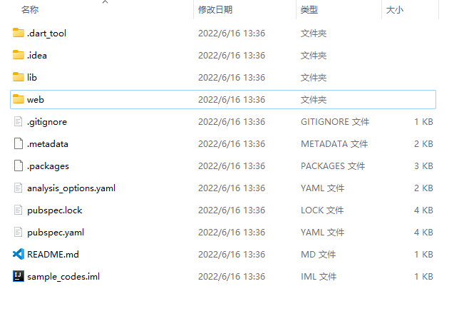

​	3.打包

​		`flutter build web`

​		打包完成之后在项目目录下会多一个`build`目录，里面有一个`web`目录，如图所示

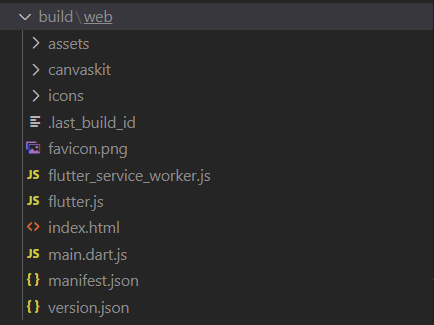

​	4.改一下 nginx配置

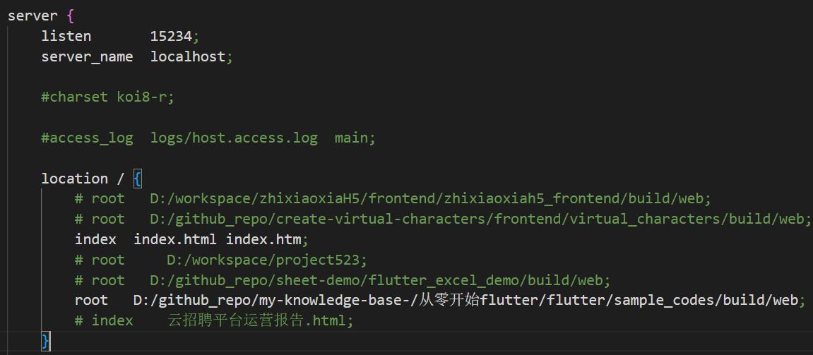

​		然后 `nginx -c conf/nginx.conf` 启动服务

​	5.开一个无痕窗口，先打开调试，然后打开这个页面

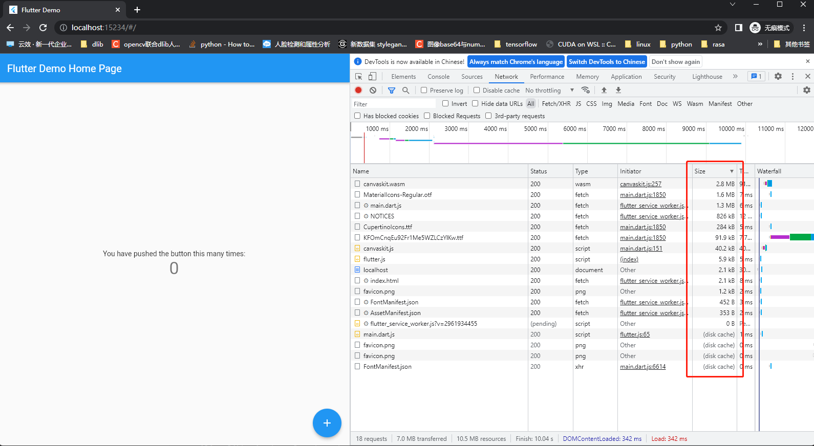

​		和前文所述一致，电脑端打开的话默认使用的是 canvaskit 渲染，而使用这种渲染方式则必须要下载`canvaskit.wasm`以及`canvas.js`等·文件，同时还有一些ttf字体。问题在哪呢？

​		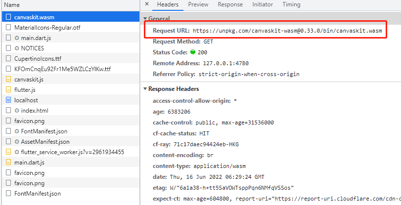

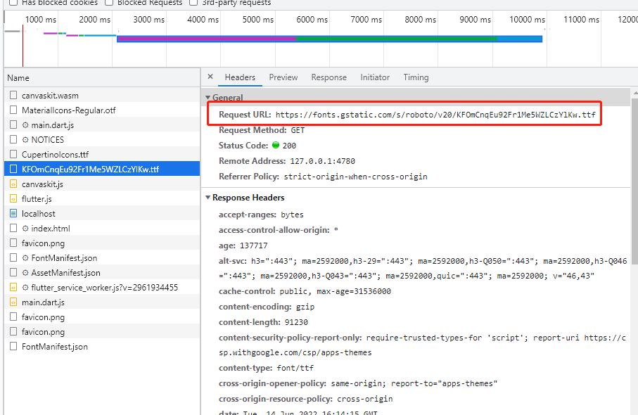

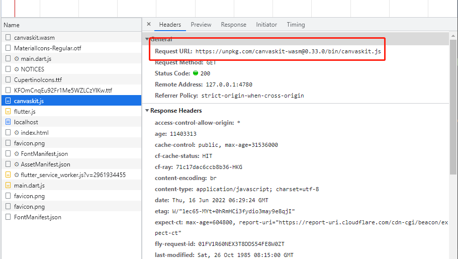

​		canvas和字体相关的cdn都是在国外的，国内访问会很慢。

*** 所以优化方案也就呼之欲出了***

**针对canvaskit的打包优化，改个cdn就行了**。

改cdn下载的方法有两种，一种是打包的时候，通过设置canvas url修改，例如

```flutter build web --dart-define=FLUTTER_WEB_CANVASKIT_URL=http://****/ ```

第二种就是在打包完成之后，修改 打包完成的main.dart.js文件

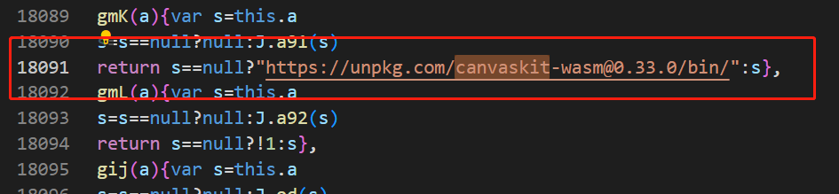

(差不过就在这个位置，所以打包的时候设定url比较方便)

> **不过canvaskit的打包方案，总归离不开canvas的下载问题，不算特别好，尤其是现在我能找到的cdn都很慢，而且我也不想花钱买cdn服务，所以才引出了html渲染的打包优化问题**

### html打包优化方案

​	1.在原来的代码基础上，重新执行打包命令

​		```flutter build web --web-renderer html```

​		(这里说句题外话，在flutter 调试模式下，也尽量加上`--web-renderer html`这个参数，否则可能导致字体丢失等问题，大概率还是网络闹的)

  2. 打开网页查看差别

     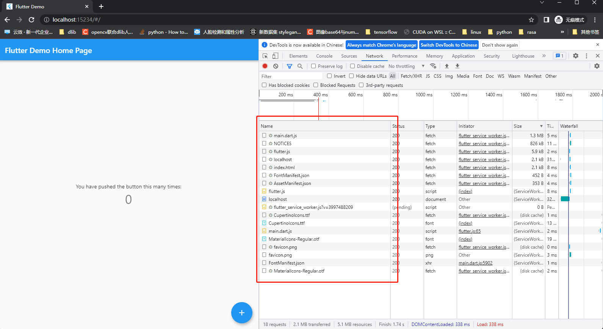

     可以看到，在这种模式下，已经没有canvas相关的文件需要下载了，而且那个乱七八糟名称的ttf字体也不见了。

**开始针对性优化**

* （如果没有需要的话）去除`CupertinoIcons.ttf`文件

  这个是ios风格的图标，如果项目中没有用到，可以直接去掉。

  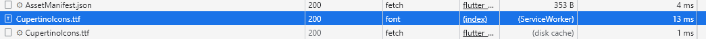

  去除的方法是修改项目的`pubspec.yaml`文件，将这行注释掉重新打包即可。

  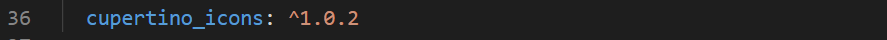

  这之后就再打开网页就不需要下载这些文件了。

  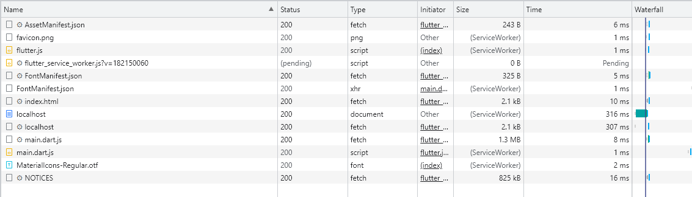

* 压缩字体（稍微有点复杂，因为当前版本flutter有bug）

  虽然删除了ttf文件，但是还有otf字体大小可以优化，这个优化是在打包的时候添加参数`--tree-shake-icons`,这个参数添加之后，flutter可以在打包的时候从 Material、Cupertino、FontAwesome 等字体中剔除未使用图标。

  但是，2.10和当前版本，在flutter web端使用这个参数会报错，异常的尴尬。

  不过也不代表没有解决方案了，受益于flutter全平台的特性，可以先打包android版本，然后从安卓打包完成的文件夹下面的已经 shake-icons 的 `MaterialIcons-Regular.otf` 资源复制到已经打包好的 web/ 目录下，算是曲线救国了。

  因为我已经把其它平台的文件都删了，所以就没有例子可以看了。贴一张效果图

  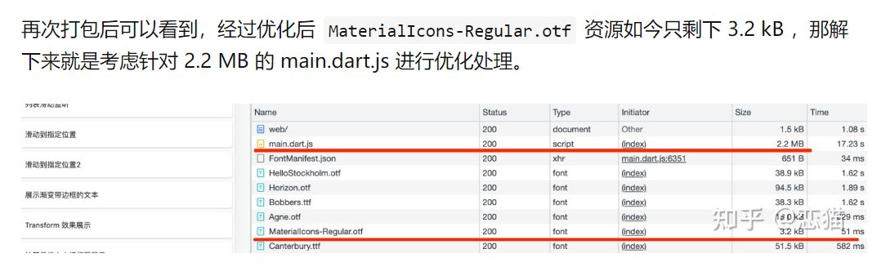

* deferred-components (重点)

  这块是重点，flutter web如果没有这块内容，可能出现一个main.dart.js文件有几十兆的情况（非常囧，因为默认情况下flutter web会把所有内容*浓缩*成一个文件...）。`deferred`是flutter中的一个关键字，是在导包（import）的时候实现组件懒加载的。注意，这是组件懒加载而不是内容懒加载。

  这里我们要修改一下代码了。

  先创建一个新的文件并导入

  > 要使用这个特性，需要创建新的文件并创建组件，同时这个文件中不能有extension，如果有的话需要在导入的时候使用show或者hide屏蔽, 什么意思呢，举个例子
  >
  > 我们创建一个文件，叫`second_widget.dart`,写入以下内容
  >
  > ```dart
  > import 'package:flutter/material.dart';
  > 
  > class SecondWidget extends StatelessWidget {
  >   const SecondWidget({Key? key}) : super(key: key);
  > 
  >   @override
  >   Widget build(BuildContext context) {
  >     return Container(
  >       child: Center(child: Text("这是一个懒加载的组件")),
  >     );
  >   }
  > }
  > 
  > extension SomeMethod on SecondWidget {
  >   static String toStr() {
  >     return "这是一个组件";
  >   }
  > }
  > ```
  >
  > `extension`是dart 2某个小版本引入的特性，有点像rust的trait，关键字都一样的 `on`
  >
  > 这时候我们在main.dart中通过deffered 关键字引入这个文件。
  >
  > 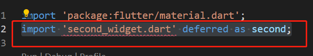
  >
  > 这时候会报错，错误内容是这样的：
  >
  > ```
  > Imports of deferred libraries must hide all extensions.
  > Try adding either a show combinator listing the names you need to reference or a hide combinator listing all of the extensions.dartdeferred_import_of_extension
  > ```
  >
  > 大致意思就是 因为second_widget.dart 这个文件下有 extension，所以不能通过deffered直接导入，需要隐藏 extension。所以如果存在这种情况，可以这样导入：
  >
  > ```da
  > import 'second_widget.dart' deferred as second show SecondWidget;
  > ```
  >
  > 或者
  >
  > ``````
  > import 'second_widget.dart' deferred as second hide SomeMethod;
  > ``````

  我们改造一下main.dart代码

  ```dart
  import 'package:flutter/material.dart';
  import 'second_widget.dart' deferred as second hide SomeMethod;
  
  void main() {
    runApp(const MyApp());
  }
  
  class MyApp extends StatelessWidget {
    const MyApp({Key? key}) : super(key: key);
  
    // This widget is the root of your application.
    @override
    Widget build(BuildContext context) {
      return MaterialApp(
        title: 'Flutter Demo',
        theme: ThemeData(
          primarySwatch: Colors.blue,
        ),
        home: const MyHomePage(title: 'Flutter Demo Home Page'),
      );
    }
  }
  
  class MyHomePage extends StatefulWidget {
    const MyHomePage({Key? key, required this.title}) : super(key: key);
  
    final String title;
  
    @override
    State<MyHomePage> createState() => _MyHomePageState();
  }
  
  class _MyHomePageState extends State<MyHomePage> {
    @override
    Widget build(BuildContext context) {
      return Scaffold(
        appBar: AppBar(
          title: Text(widget.title),
        ),
        body: Center(
          child: FutureBuilder<void>(
            future: second.loadLibrary(),
            builder: (BuildContext context, AsyncSnapshot<void> snapshot) {
              if (snapshot.connectionState == ConnectionState.done) {
                if (snapshot.hasError) {
                  return Text('Error: ${snapshot.error}');
                }
                return second.SecondWidget();
              }
              return CircularProgressIndicator();
            },
          ),
        ),
      );
    }
  }
  
  ```

  然后重新打包一下。

  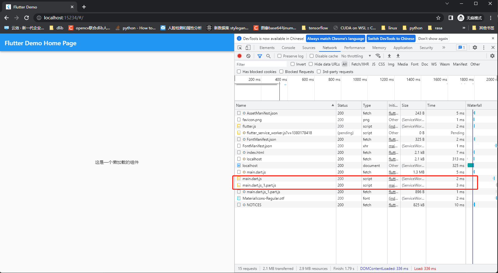

  再运行的时候，就能看到多了一个 `main.dart.js_1.part.js` 文件了。通过这种 deffered 的方式，可以将一个本来很`庞大`的main文件拆解出来，让浏览器异步获取，然后加载，避免大文件下载耗时的问题。

  > 另外，defered这个关键字在移动端也很有用，主要是用于下载资源或者其它耗时操作（但是我觉得future应该也可以用），在移动端使用的话，需要在pubspec.yaml中添加libraries路径，例如：
  >
  > ```yaml
  > deferred-components:
  >   - name: any  #这个名称应该是随意的
  >     libraries:
  >       - package:sample_codes/second_widget.dart
  > ```
  >
  > 当然再好的酒也不要贪杯，因为很多时候deffered写多了脑袋大，在性能和代码可读性之间要自己做个权衡。这是一个 [案例](https://guchengxi1994.github.io/taichi/#/)
  >
  > 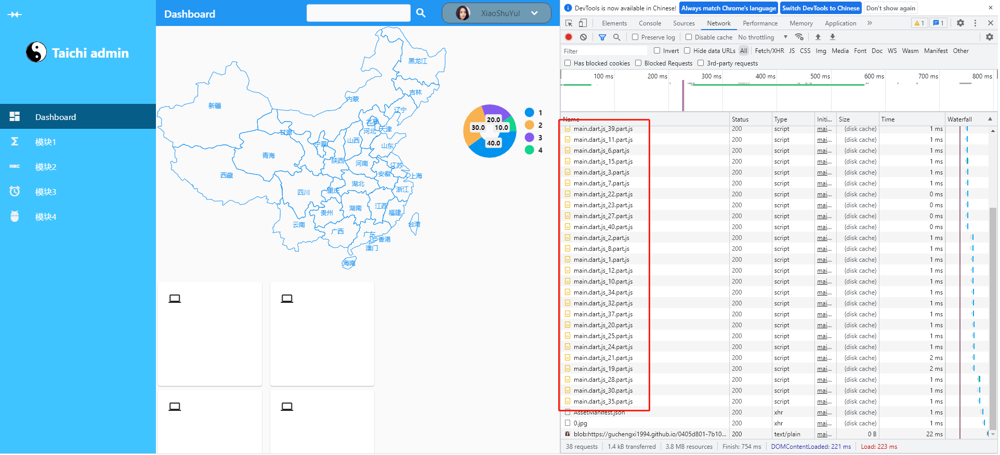
  >
  > 我用flutter写的一个全平台自适应管理平台模板，基本上每个组件能用defered关键字的都在用，然后同时有几十个js文件需要下载，代码高内聚低耦合，还好逻辑比较简单不然不写注释很容易忘记组件的作用。

* 其它

  * 压缩js文件

    `“在部署的时候开始gzip或者brotli压缩”`

    这里使用的是nginx 开启gzip压缩的实验，brotli没有实验

    在nginx配置文件中添加以下内容

    ```
    gzip  on;
    gzip_min_length  1k;
    gzip_buffers     4 16k;
    gzip_http_version 1.1;
    gzip_comp_level 9;
    gzip_types       text/plain application/x-javascript text/css application/xml text/javascript application/x-httpd-php application/javascript application/json;
    gzip_disable "MSIE [1-6]\.";
    gzip_vary on;
    ```
  
    然后重启一下服务器。
  
    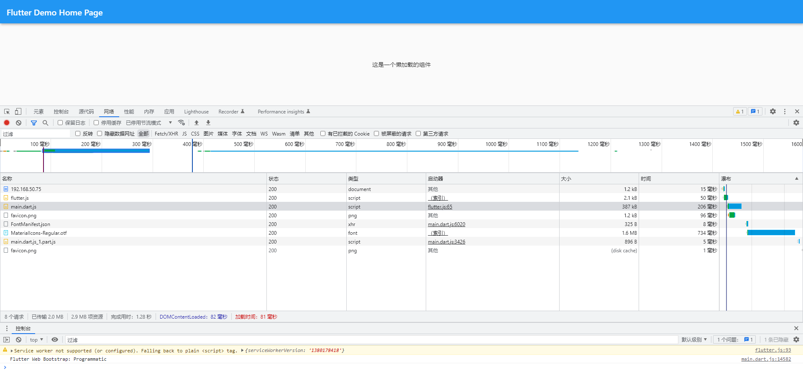
  
    这里的文件已经压缩到300多kb，同时，由于开启了gzip压缩，`Response Headers`中会多一行内容。
  
    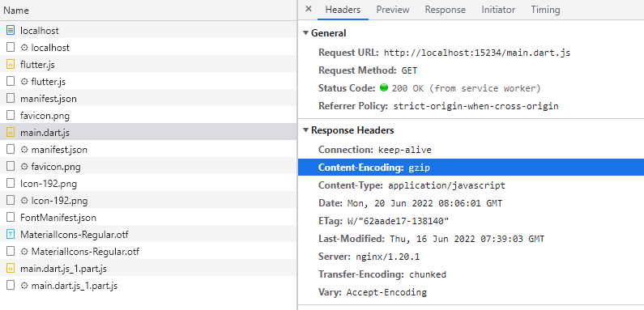
  
  * 修改index.html文件，添加loading效果
  
    ```html
    <!DOCTYPE html>
    <html>
    <head>
      <meta charset="UTF-8">
      <title>gsy_flutter_demo</title>
      <style>
        .loading {
          display: flex;
          justify-content: center;
          align-items: center;
          margin: 0;
          position: absolute;
          top: 50%;
          left: 50%;
          -ms-transform: translate(-50%, -50%);
          transform: translate(-50%, -50%);
        }
    
        .loader {
          border: 16px solid #f3f3f3;
          border-radius: 50%;
          border: 15px solid ;
          border-top: 16px solid blue;
          border-right: 16px solid white;
          border-bottom: 16px solid blue;
          border-left: 16px solid white;
          width: 120px;
          height: 120px;
          -webkit-animation: spin 2s linear infinite;
          animation: spin 2s linear infinite;
        }
    
        @-webkit-keyframes spin {
          0% {
            -webkit-transform: rotate(0deg);
          }
          100% {
            -webkit-transform: rotate(360deg);
          }
        }
    
        @keyframes spin {
          0% {
            transform: rotate(0deg);
          }
          100% {
            transform: rotate(360deg);
          }
        }
      </style>
    </head>
    <body>
      <div class="loading">
        <div class="loader"></div>
      </div>
      <script src="main.dart.js" type="application/javascript"></script>
    </body>
    </html>
    ```
  
    我这个用的多，使用的时候把web下index.html文件下所有文件替换为这个即可。
  
  ### 总结
  
  ​		基本上打包优化就是这些内容，还有一些[渲染相关](https://zhuanlan.zhihu.com/p/511181734)的内容，因为涉及到大量源码阅读，所以不多做介绍了。
