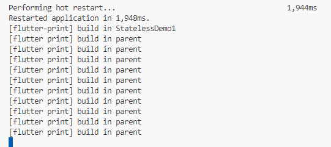
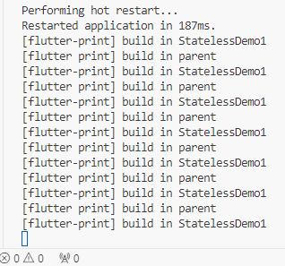
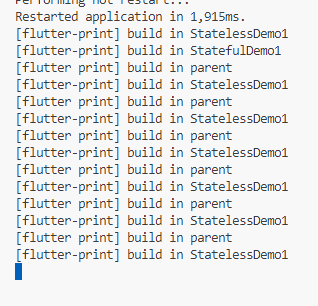
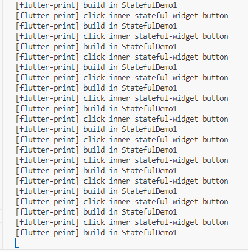
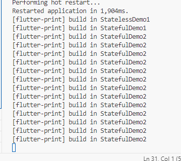
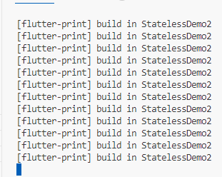

# flutter widgets

### stateful / stateless widget

stateful/stateless算是flutter中自定义组件最常用的入口。以下是几个简单的例子。

* stateless

  ```dart
  class StatelessDemo1 extends StatelessWidget {
    const StatelessDemo1({Key? key, required this.text}) : super(key: key);
    final String text;
  
    @override
    Widget build(BuildContext context) {
      debugPrint("[flutter-print] build in StatelessDemo1");
      return FittedBox(
        child: Text(text),
      );
    }
  }
  ```

  这个例子是父级组件传值一个`text`变量进来，然后使用`Text`组件进行渲染。

  在父级组件中改造一下代码，添加一个按钮刷新父级页面：

  ```dart
  class MyApp extends StatefulWidget {
    const MyApp({Key? key}) : super(key: key);
  
    @override
    State<MyApp> createState() => _MyAppState();
  }
  
  class _MyAppState extends State<MyApp> {
    @override
    Widget build(BuildContext context) {
      return Scaffold(
        body: Center(
          child: Column(
            children: [
              const StatelessDemo1(text: "aaaa"),
              ElevatedButton(
                  onPressed: () {
                    setState(() {});
                    debugPrint("[flutter print] build in parent");
                  },
                  child: const Text("刷新"))
            ],
          ),
        ),
      );
    }
  }
  
  ```

  这里点击按钮，并不会触发子组件的重绘（不执行子组件build方法）。



这里再改造一下代码。

```da
class MyApp extends StatefulWidget {
  const MyApp({Key? key}) : super(key: key);

  @override
  State<MyApp> createState() => _MyAppState();
}

class _MyAppState extends State<MyApp> {
  int times = 0;

  @override
  Widget build(BuildContext context) {
    return Scaffold(
      body: Center(
        child: Column(
          children: [
            StatelessDemo1(text: times.toString()),
            ElevatedButton(
                onPressed: () {
                  setState(() {
                    times += 1;
                  });
                  debugPrint("[flutter print] build in parent");
                },
                child: const Text("刷新"))
          ],
        ),
      ),
    );
  }
}
```



这里改变了父级的变量`times`,引起了子组件的重绘。

* stateful

  ```dart
  class StatefulDemo1 extends StatefulWidget {
    const StatefulDemo1({Key? key, required this.text}) : super(key: key);
    final String text;
  
    @override
    State<StatefulDemo1> createState() => _StatefulDemo1State();
  }
  
  class _StatefulDemo1State extends State<StatefulDemo1> {
    @override
    Widget build(BuildContext context) {
      debugPrint("[flutter-print] build in StatefulDemo1");
      return FittedBox(
        child: Text(widget.text),
      );
    }
  }
  // parent
  class MyApp extends StatefulWidget {
    const MyApp({Key? key}) : super(key: key);
  
    @override
    State<MyApp> createState() => _MyAppState();
  }
  
  class _MyAppState extends State<MyApp> {
    int times = 0;
  
    @override
    Widget build(BuildContext context) {
      return Scaffold(
        body: Center(
          child: Column(
            children: [
              StatelessDemo1(text: times.toString()),
              const StatefulDemo1(text: "aaa"),
              ElevatedButton(
                  onPressed: () {
                    setState(() {
                      times += 1;
                    });
                    debugPrint("[flutter print] build in parent");
                  },
                  child: const Text("刷新"))
            ],
          ),
        ),
      );
    }
  }
  ```

  

​	与stateless的例子一样，外部的刷新没有导致内部statefulwidget刷新，因为`text`是常量，所以当`text`为变量的时候，会如何呢？


> 思考：如果内部组件刷新，会不会导致外部组件刷新？

```dart
class StatefulDemo1 extends StatefulWidget {
  const StatefulDemo1({Key? key, required this.text}) : super(key: key);
  final String text;

  @override
  State<StatefulDemo1> createState() => _StatefulDemo1State();
}

class _StatefulDemo1State extends State<StatefulDemo1> {
  @override
  Widget build(BuildContext context) {
    debugPrint("[flutter-print] build in StatefulDemo1");
    return FittedBox(
      child: Column(
        children: [
          Text(widget.text),
          ElevatedButton(
              onPressed: () {
                setState(() {
                  debugPrint(
                      "[flutter-print] click inner stateful-widget button");
                });
              },
              child: const Text("内部刷新"))
        ],
      ),
    );
  }
}
```



内部组件的setState并不能使外部整个组件刷新，所以可以通过组件封装减少重绘区域，提高性能。

* 几种控制widget刷新的方法(不使用状态管理)

  * GlobalKey（statefulwidget）

    ```dart
    class StatefulDemo2 extends StatefulWidget {
      const StatefulDemo2({Key? key}) : super(key: key);
    
      @override
      State<StatefulDemo2> createState() => StatefulDemo2State();
    }
    
    class StatefulDemo2State extends State<StatefulDemo2> {
      int times = 0;
    
      addOne() {
        times += 1;
        setState(() {});
      }
    
      minusOne() {
        times -= 1;
        setState(() {});
      }
    
      @override
      Widget build(BuildContext context) {
        debugPrint("[flutter-print] build in StatefulDemo2");
        return FittedBox(
          child: Text(times.toString()),
        );
      }
    }
    
    
    // main
    class MyApp extends StatefulWidget {
      const MyApp({Key? key}) : super(key: key);
    
      @override
      State<MyApp> createState() => _MyAppState();
    }
    
    class _MyAppState extends State<MyApp> {
      int times = 0;
      final GlobalKey<StatefulDemo2State> globalKey = GlobalKey();
    
      @override
      Widget build(BuildContext context) {
        return Scaffold(
          body: Center(
            child: Column(
              children: [
                StatelessDemo1(text: times.toString()),
                const StatefulDemo1(text: "aaa"),
                ElevatedButton(
                    onPressed: () {
                      setState(() {
                        times += 1;
                      });
                      debugPrint("[flutter print] build in parent");
                    },
                    child: const Text("刷新")),
                const SizedBox(
                  height: 40,
                ),
                StatefulDemo2(
                  key: globalKey,
                ),
                Row(
                  children: [
                    ElevatedButton(
                        onPressed: () {
                          globalKey.currentState!.addOne();
                        },
                        child: Text("+1")),
                    ElevatedButton(
                        onPressed: () {
                          globalKey.currentState!.minusOne();
                        },
                        child: Text("-1")),
                  ],
                )
              ],
            ),
          ),
        );
      }
    }
    
    ```

    globalKey 的这种刷新方式也不会使外部刷新。

    

  * ValueNotifier

    ```dart
    class StatelessDemo2 extends StatelessWidget {
      const StatelessDemo2({Key? key, required this.times}) : super(key: key);
      final int times;
    
      @override
      Widget build(BuildContext context) {
        debugPrint("[flutter-print] build in StatelessDemo2");
        return FittedBox(
          child: Text(times.toString()),
        );
      }
    }
    
    // main
    class MyApp extends StatefulWidget {
      const MyApp({Key? key}) : super(key: key);
    
      @override
      State<MyApp> createState() => _MyAppState();
    }
    
    class _MyAppState extends State<MyApp> {
      int times = 0;
      final GlobalKey<StatefulDemo2State> globalKey = GlobalKey();
    
      final ValueNotifier<int> notifier = ValueNotifier(0);
    
      @override
      Widget build(BuildContext context) {
        return Scaffold(
          body: Center(
            child: Column(
              children: [
                StatelessDemo1(text: times.toString()),
                const StatefulDemo1(text: "aaa"),
                ElevatedButton(
                    onPressed: () {
                      setState(() {
                        times += 1;
                      });
                      debugPrint("[flutter print] build in parent");
                    },
                    child: const Text("刷新")),
                const SizedBox(
                  height: 40,
                ),
                StatefulDemo2(
                  key: globalKey,
                ),
                Row(
                  children: [
                    ElevatedButton(
                        onPressed: () {
                          globalKey.currentState!.addOne();
                        },
                        child: Text("+1")),
                    ElevatedButton(
                        onPressed: () {
                          globalKey.currentState!.minusOne();
                        },
                        child: Text("-1")),
                  ],
                ),
                const SizedBox(
                  height: 40,
                ),
                ValueListenableBuilder(
                    valueListenable: notifier,
                    builder: (c, i, child) {
                      return StatelessDemo2(times: notifier.value);
                    }),
                Row(
                  children: [
                    ElevatedButton(
                        onPressed: () {
                          notifier.value += 1;
                        },
                        child: Text("+1")),
                    ElevatedButton(
                        onPressed: () {
                          notifier.value -= 1;
                        },
                        child: Text("-1")),
                  ],
                ),
              ],
            ),
          ),
        );
      }
    }
    ```

    

    这种方式，同样不会触发父级组件重绘。

    > 思考： 如果子组件是个stateful widget,还可以通过这种notifier方案重绘吗？
    >
    > 思考： 还有没有别的方案可以控制重绘？

* 状态管理（以provider为例）