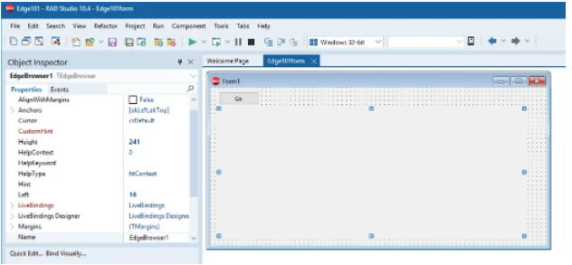

# 0. 写在最前面的话

​		本内容适合对编程有一定了解的人群，尤其是面向对象相关的知识。如果是一名Java开发人员，那么flutter/dart就是谷歌给Java开发人员学习UI搭建最好的礼物。我会尽量通俗易懂地讲解所有内容，让没有编程基础的也能够直接从代码中找到豁然开朗的快乐。

​		[《Flutter实战》](https://book.flutterchina.club/)这本书是以移动端为核心的，但是flutter能做的远不止移动端，所以本内容更多的会采用全平台搭建UI的方式讲解。同时，如果涉及到整活，我会尽量以原生android(java)为例。

# 1. 一些UI框架/构建工具分享

## 1.1 Delphi

​		首先要说的肯定是老大哥级别的UI构建工具,Delphi。Delphi是一个集成开发环境,使用的语言是Object Pascal,以图形用户界面为开发环境，透过IDE、VCL工具与编译器，配合连结数据库的功能，构成一个以面向对象程序设计为中心的应用程序开发工具[^1]。

图1-1 Delphi 编程页面

​		Delphi是一个可视化的编程平台,上手难度较低。用户可以将组件拖动到设计器上完成页面（Form）的绘制。然后绑定组件的事件就可以完成简单的程序。最早的Delphi只支持Windows程序开发,但是之后已经支持开发Android,Linux等跨平台应用。

​		尽管Delphi很多时候都很便利，但是由于当时web应用开发兴起的时候没有选择激流勇进，导致Delphi已经快被时代抛弃了。

## 1.2 Qt与PyQt[^2]

​		Qt 是一个1991年由Qt Company开发的跨平台开发框架。Qt是面向对象的框架，使用特殊的代码生成扩展（称为元对象编译器(Meta Object Compiler, moc)）以及一些宏，Qt很容易扩展，并且允许真正地组件编程。

​		PyQt是一个创建GUI应用程序的工具包。它是Python编程语言和Qt库的成功融合。Python语言不仅是一种面向对象的高级动态编程语言，而且本身也是跨平台的，相比于其它如C/C++语言，具有上手快、代码少、开发效率高的特点，再加上Qt的编写GUI界面的强大性，因此对于软件开发者来讲，基于Python语言，配合Qt界面库编写软件界面程序，应该说是比较经典的一种程序架构，这种Python+PyQt的程序框架结构即考虑了程序的开发时间效率，也兼顾了复杂漂亮界面的完成能力。

## 1.3 基于JavaScript+原生的跨平台技术

# 2. dart与flutter

[^1]: 题外话:2012/2013年学"面向对象程序编程"的时候，老师就是用的Delphi授课。当时只是个小白，所以觉得Delphi是真的方便。现在想想，如果当时老师用的是c#，Java等语言也许更好。当时Python还没火，但是Delphi却已经日薄西山了。
[^2]: 我没有c/c++的编程经验，所以Qt这块只接触过PyQt。